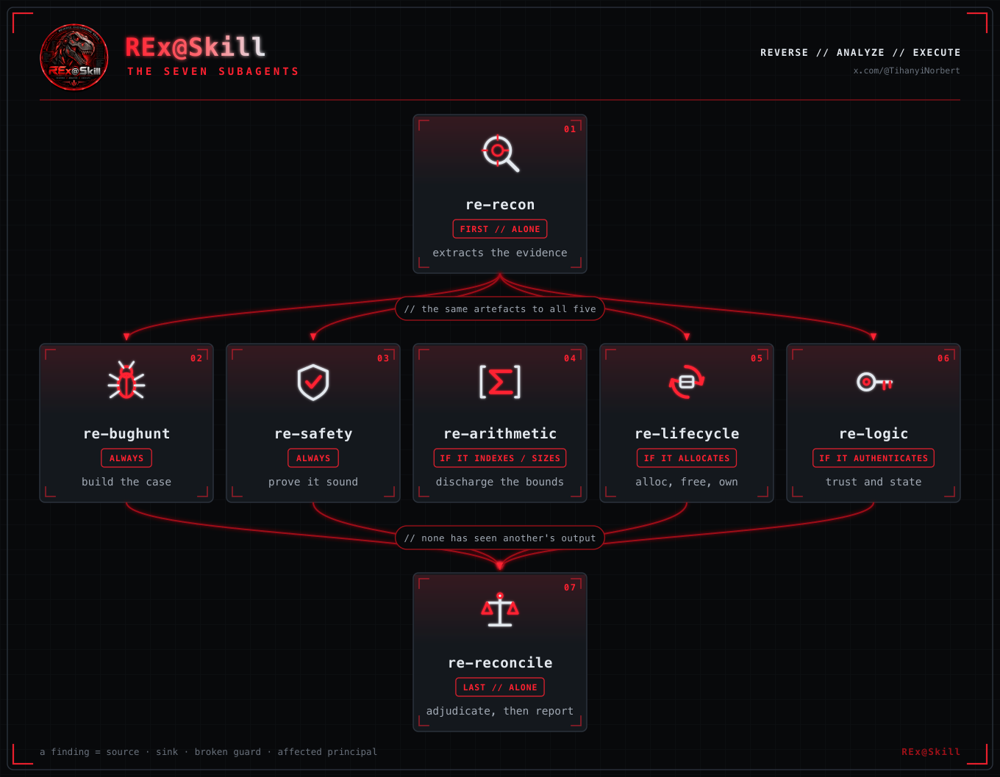

<div align="center">


# REx@Skill

### Reverse Engineering eXecution Skill

*Find the defects in a compiled binary — and prove them.*<br>
Seven subagents, one evidence tree, and a pinned toolchain so two runs are comparable.

<br>

[](https://github.com/tihanyin/REx-skill/releases/latest)


<br>

               

<sub>Ghidra · radare2 · rizin · qemu-user · angr · z3 · AFL++ · valgrind · capa · Unicorn · Triton · Frida · semgrep · clang · Python · Nix<br><b>all pinned</b>, all reproducible</sub>

</div>

---

## 1. Install the Claude skill

**1 · Claude Code** — skip if you already have it.

```bash
curl -fsSL https://claude.ai/install.sh | bash
```

**2 · REx@Skill** — 1 skill, 12 references, **7 subagents**, **33 scripts**.

```bash
curl -fsSL https://raw.githubusercontent.com/tihanyin/REx-skill/main/install.sh | sh
```

**3 · analyse a binary.**

```bash
claude
> /re-analyze path/to/binary        # one target
> /re-analyze path/to/directory/    # a whole corpus, evidence gathered in parallel
```

<div align="center">
<sub><code>install.sh</code> writes only to <code>~/.claude/</code> — the skill and its 33 pipeline scripts, the 7 agents, <code>/re-analyze</code>.<br>It never installs Claude Code for you; it backs up anything it would overwrite, and <code>--uninstall</code> removes it cleanly.</sub>
</div>

<br>

<details>
<summary><b>Prefer to clone?</b> &nbsp;· &nbsp;<i>or install somewhere else, or remove it</i></summary>

```bash
git clone https://github.com/tihanyin/REx-skill && cd REx-skill
./install.sh                              # into ~/.claude
./install.sh --prefix ~/.config/claude    # somewhere else
./install.sh --uninstall                  # take it back out
```

</details>

---

## 2. Tools used by this skill

<div align="center">

        

<code>Ghidra</code> · <code>radare2</code> · <code>rizin</code> · <code>qemu-user</code> · <code>angr</code> · <code>z3</code> · <code>AFL++</code> · <code>valgrind</code> · <code>capa</code>

        

<code>Unicorn</code> · <code>Triton</code> · <code>Frida</code> · <code>semgrep</code> · <code>clang</code> · <code>Python</code> · <code>Nix</code> · <code>Linux</code> · <code>Claude</code>

</div>

<br>

**REx@Skill** uses state-of-the-art tools collected by reverse-engineering experts.
Each one is in the set because it earns its place on known benchmarks and real
binary-analysis challenges — not because it was convenient to install. Nothing
here is reimplemented; the skill's own job is knowing which tool answers the
question in front of it, and what its answer is worth.

| Tool | What it does |
|---|---|
| **Ghidra** | turns a compiled binary back into readable C |
| **radare2** / **rizin** | a second decompiler, used to cross-check the first |
| **qemu-user** | runs ARM, MIPS, PowerPC and RISC-V binaries on a normal x86 machine |
| **z3** | a maths solver — proves whether an index can leave its buffer, or a divisor can be zero |
| **angr** | works out what input would reach a given line of code |
| **AFL++** | throws millions of generated inputs at the program to make it crash |
| **valgrind** | catches memory bugs that otherwise cause no visible error |
| **libdislocator** | makes reading one byte past a buffer crash straight away |
| **capa** | lists what the binary can do: encrypt, open sockets, inject into processes |
| **floss** | finds hidden text that plain `strings` misses |
| **Unicorn** | runs a single function on inputs you choose, without running the program |
| **Triton** | follows where attacker-controlled data travels during a run |
| **Frida** | watches and changes a program while it is running |
| **semgrep** / **cppcheck** | scan the decompiled C for known bad patterns |
| **pwntools** | the helper library for offsets, ELF parsing and exploit work |

These are the exact versions it was built and measured with:

> **Ghidra 12.1.2** · radare2 6.2.0 · rizin 0.9.1 · **qemu-user 11.1.0** + 9 cross-sysroots ·
> **angr 9.2.154** · **z3 4.16.0** · **AFL++ 5.00c** · valgrind 3.27.1 · capa 9.4.0 ·
> Unicorn 2.1.4 · Triton 3.7.0 · Frida 17.17.0 · clang 21.1.8 · semgrep 1.172.0 ·
> floss 3.1.1 · yara 4.5.7 · binwalk 3.1.0 · pwntools 4.15.0 · cppcheck 2.21.1

**Every one is optional.** `scripts/capabilities.sh` reports what this machine has,
each script names the tool it cannot find, and a missing tool narrows the analysis
into `limitations` rather than failing silently.

<a id="devshell"></a>

### Don't have them? The DEVSHELL installs all of it, pinned

Three commands and every tool above is on your `PATH`, at exactly these versions —
nothing to hunt down, nothing left half-configured.

```bash
git clone https://github.com/tihanyin/REx-skill 2>/dev/null || git -C REx-skill pull
cd REx-skill
curl --proto '=https' --tlsv1.2 -sSf -L https://install.determinate.systems/nix | sh -s -- install --no-confirm
nix develop ./devshell
scripts/capabilities.sh
```

| | |
|---|---|
| **0** | clones the repo, or updates it if you already have one — the one-line skill installer above does **not** leave a clone behind, it works from a temporary checkout and removes it, so the toolchain and the scripts need one of their own |
| **1** | installs Nix, the package manager that does the pinning — then **open a new terminal**. *Already have Nix? Skip it.* Re-running the installer over an existing install fails with `Found existing plan in /nix/receipt.json`, which is it declining to touch what you already have, not an error to fix |
| **2** | enters the shell, from the repo root so `scripts/` stays on hand. First time downloads a lot; every time after is seconds |
| **3** | confirms it: `ghidra pyghidra r2 rizin`, `qemu-user architectures: 7`, `angr`, `z3`, `afl` — instead of the `MISS` lines a bare machine gives |

`exit` puts your `PATH` back exactly as it was. *Tested on Ubuntu 22.04.5 LTS
(x86-64), Determinate Nix 3.22.4.*

<details>
<summary><b>Why pin the toolchain at all?</b></summary>

- **Comparable runs.** The decompiler's output *is* the analyst's input. Two people
  on two Ghidra versions are not doing the same experiment, and neither can check
  the other's result.
- **Nothing installed on your machine.** Nix keeps every package under a hash of
  what built it, so entering the shell changes `PATH` and nothing else. Leave the
  shell and your system is exactly as it was.
- **It still works in five years.** Three pinned revisions rebuild the whole
  toolchain, which is what makes a published number re-checkable later.

Three revisions rebuild the entire toolchain, on any machine, at any point in the
future:

```
nixpkgs        ffb3c9b700e759be2ef13237c9d8f953b32a1e46
nixpkgs-angr   ac62194c3917d5f474c1a844b6fd6da2db95077d
capa-rules     v9.4.0
```

`devshell/flake.lock` is the authority; [`devshell/DEVSHELL.md`](devshell/DEVSHELL.md)
lists every tool with its version and what it is for.

</details>

---

## 3. REx@Skill methodology and architecture

**REx@Skill** is a method for deciding whether a binary has a defect — and proving
it. Seven subagents run it, sharing one evidence directory.

One agent turns the binary into evidence: decompiled C, disassembly, strings, a map
of which code reaches which, and what happens when you actually run it. Five agents
then read that evidence at the same time, each hunting a different kind of defect,
and **none of them can see what the others found** — five readers sharing one
decompiler make the same mistakes, so keeping them apart buys five independent
readings instead of one opinion repeated five times. A seventh reads the code
first, *then* their findings, and decides which ones hold up.

Nothing is reported as a bug unless four things are named and located in the
binary: where attacker-controlled data gets in (**source**), the operation it can
break (**sink**), the check that should have stopped it (**broken guard**), and who
is harmed (**affected principal**). Miss one and it goes out as an unproven lead,
not a finding.

Every run delivers the same three things: the findings, what was **ruled out** and
why, and what the host **could not run**.

**The skillset has been tested across ten architectures** — x86-64, i686, ARM,
AArch64, MIPS and MIPS64 in both endiannesses, 32-bit PowerPC, RISC-V and Apple
arm64 — on ELF, PE and Mach-O, firmware and raw blobs. Nothing caps it there: any
architecture your decompiler can lift is in scope.

<div align="center">

</div>

<div align="center"><sub><a href="images/agents.svg">SVG</a></sub></div>

| | Agent | Runs | In one line |
|---|---|---|---|
| **01** | `re-recon` | first, alone | Extracts the evidence. **Does not hunt bugs** — a confident finding here is the failure mode. |
| **02** | `re-bughunt` | always | Builds the strongest honest case that a defect exists. Enumerates every sink. |
| **03** | `re-safety` | always | Tries to prove it sound, and reports every obligation it *cannot* discharge. |
| **04** | `re-arithmetic` | if it indexes or sizes | Size, index, width and signedness across call boundaries — discharged by a solver, not in someone's head. |
| **05** | `re-lifecycle` | if it allocates | Allocation, free, ownership, init and error paths. The error path is the one nobody tested. |
| **06** | `re-logic` | if it authenticates | Authorisation, state machines, crypto, validate-here-use-there. No signature to grep for. |
| **07** | `re-reconcile` | last, alone | Reads the **code** before it reads anyone's conclusions, then adjudicates and reports. |

<details>
<summary><b>What you get back</b></summary>

One directory per binary, named `<filename>-<first 8 hex of its SHA-256>`:

```
results/
├── index.json                      every sha256 analysed -> its directory
└── httpd-4f2a9c1e/                 <- "httpd", sha256 4f2a9c1e...
    ├── decomp/      decompiled C            ├── reach/       source -> sink paths
    ├── disasm/      disassembly, real VAs   ├── bounds/      arithmetic to discharge
    ├── meta/        function map + base     ├── sanitize/    hostile-allocator runs
    ├── strings/     inventory, by family    ├── fuzz/        coverage-guided search
    ├── dynamic/     crafted-input battery   ├── quarantine/  text aimed at YOU
    └── notes/       the threat model        └── pipeline.json  what ran, what did not
```

**Why the hash is in the name.** Two builds of a program share a filename but not a
SHA-256, so evidence and binary cannot silently drift apart: recompile the target and
you get a new directory rather than a polluted one.

`pipeline_status.py` audits that tree and reports which stages never ran — because a
stage that never ran leaves no error behind, only an absent directory, which reads
exactly like "ran, found nothing".

</details>

---

## 4. Tool inventory — which script calls what

#### Decompile and read

| Tool | Version | Used by | For |
|---|---|---|---|
| **Ghidra** | 12.1.2 | `ghidra_export.py` `batch_decompile.sh` `decompile_addr.py` | the decompiler — the load-bearing tool |
| **pyghidra** | 3.1.0 | the same three | driving it headless |
| radare2 | 6.2.0 | `run_tools.sh` `strings_report.py` `brief.py` | JSON out of every command |
| rizin | 0.9.1 | `capabilities.sh` `preflight.sh` | a **second** decompiler — cross-check |
| binutils | 2.46 | `triage.py` `inventory.py` `run_tools.sh` | readelf, objdump, nm, strings, size |
| file | 5.48 | every entry point | first command, every time |

#### Triage — what is it, what can it do

| Tool | Version | Used by | For |
|---|---|---|---|
| **capa** | 9.4.0 | `run_tools.sh` `brief.py` | capabilities from rules, with addresses |
| **floss** | 3.1.1 | `strings_report.py` | strings `strings` cannot see |
| yara | 4.5.7 | `run_tools.sh` `analyze.sh` | packers, crypto constants, library versions |
| detect-it-easy | 3.21 | `run_tools.sh` | packer and compiler identification |
| checksec | pwntools | `triage.py` `brief.py` | NX / RELRO / canary / PIE |

#### Execute — the largest single lever

| Tool | Version | Used by | For |
|---|---|---|---|
| **qemu-user** | 11.1.0 | `dynamic_probe.py` `quick_dynamic.sh` | run foreign-architecture binaries |
| **9 cross-sysroots** | glibc | `setup_sysroots.sh` | without them qemu cannot even load a foreign dynamic binary |
| gdb / ltrace / strace | 17.2 | `capabilities.sh` reports them | traces; `ltrace` is the most under-used tool here |

> On one measured comparison the same model scored roughly **3× the recall** with
> execution available than without. This row is why the sysroots ship with the flake.

#### Make silent bugs loud

| Tool | Version | Used by | For |
|---|---|---|---|
| **valgrind** | 3.27.1 | `sanitize_run.sh` | the closest thing to ASan for a binary you cannot rebuild |
| **AFL++** | 5.00c | `fuzz_target.sh` `quick_dynamic.sh` | coverage-guided fuzzing, QEMU mode |
| libdislocator | with AFL++ | `sanitize_run.sh` `quick_dynamic.sh` | page-per-allocation — turns a silent OOB read into a fault |
| clang | 21.1.8 | `triage.py` | `-fsanitize=...` on lifted code |

#### Solve and emulate

| Tool | Version | Used by | For |
|---|---|---|---|
| **z3** | 4.16.0 | `check_bound.py` | discharges a bounds claim — 9 modes plus a generic escape hatch |
| **angr** | 9.2.154 | `symfn.py` | symbolic harness per function: hijack, OOB write, divide-by-zero |
| **unicorn** | 2.1.4 | `emulate.py` | run ONE function in isolation on inputs you choose |
| triton | 3.7.0 | available | concolic execution and taint over a concrete trace |
| pwntools | 4.15.0 | `brief.py` `run_tools.sh` | `cyclic()` offsets, ELF/GOT parsing |

#### Static analysis over decompiled C

| Tool | Version | Used by | For |
|---|---|---|---|
| cppcheck | 2.21.1 | `run_tools.sh` `analyze.sh` | tolerates code that does not compile — decompiler output does not |
| semgrep | 1.172.0 | `run_tools.sh` `analyze.sh` | pattern rules, no build needed |
| flawfinder | 2.0.20 | `capabilities.sh` | lexical; a grep with opinions |

<details>
<summary><b>Also in the shell</b> — firmware, formats, exploitability</summary>

`binwalk` 3.1.0 · `unsquashfs` · `sasquatch` · `jefferson` · `ubi_reader` ·
`kaitai-struct-compiler` 0.11 · `tshark` 4.6.8 · `hexyl` · `pev` 0.81 ·
`osslsigncode` · `diffoscope` 328 · `patchelf` 0.15.2 · `ROPgadget` 7.7 ·
`one_gadget` 1.9.0 · `honggfuzz` · `radamsa` 0.7 · `bitwuzla` 0.9.1 · `rr` 5.9.0 ·
`bpftrace` 0.26.0 · `upx` 5.2.0

Full inventory with every version: [`devshell/DEVSHELL.md`](devshell/DEVSHELL.md)

</details>

---

## 5. Use it with something other than Claude

`general-skill/SKILL-RE.md` is **one self-contained file** — 3 750 lines of plain
Markdown with `name`/`description` frontmatter. Everything the Claude bundle has,
in one piece: the same evidence standard, the same pipeline, the same rules about
fuzzing a foreign architecture. Clone the repo so `scripts/` sits beside it, then:

| Runner | How |
|---|---|
| **Codex** | point `AGENTS.md` at it, or paste it as the system prompt |
| **opencode** | `{"instructions": ["SKILL-RE.md"]}` in `opencode.json` |
| **Cursor / Windsurf** | drop it in as a project rule |
| **A plain API loop** | it is just Markdown — prepend it |
| **A human** | it reads as a textbook; that was the point |

> **Why two forms?** The Claude bundle is a 16 KB core plus twelve reference files
> loaded on demand — small context until a specific question needs a specific
> chapter. Only Claude Code follows those pointers, so every other runner gets the
> single file instead.

---

---

## 6. What is inside

```
.
├── claude-skill/          the Claude Code form
│   ├── skills/reverse-engineering/
│   │   ├── SKILL.md           16 KB core, loaded on every trigger
│   │   └── references/        12 files, pulled in on demand
│   ├── agents/                7 subagents
│   └── commands/              /re-analyze — orchestrates all three phases
│
├── general-skill/         the portable form
│   ├── SKILL-RE.md            the whole methodology, one file, 32 sections
│   └── AGENTS.md              points any agent at it
│
├── scripts/               32 tools — the pipeline and its parts
├── devshell/              flake.nix + flake.lock + DEVSHELL.md
├── images/                logo and figures
└── install.sh             one command into ~/.claude
```

### The scripts that matter

| | |
|---|---|
| `capabilities.sh` | what this host can actually do — **check before planning** |
| `analyze.sh` | the whole pipeline in order, steps 0-5, then hands off |
| `batch_analyze.sh` | the same pipeline across a **directory** of targets |
| `pipeline_status.py` | audit an evidence tree: which stages ran, and what each absence costs |
| `overview.py` | the shape of a program: counts, call tree, sinks, sources |
| `brief.py` | every tool's output for one target, consolidated, gaps named |
| `fn.py` | read **one** function instead of the whole decompilation |
| `reach.py` | source → sink paths over the call graph |
| `bounds_worklist.py` | the arithmetic claims that need discharging, in three tiers |
| `check_bound.py` | discharge one with z3 — 9 modes plus a generic escape hatch |
| `symfn.py` | symbolic harness for one function |
| `emulate.py` | run one function in isolation on inputs you choose |
| `quick_dynamic.sh` | just run it: no input, then inputs that break most things |
| `fuzz_target.sh` | fuzzing aimed at the channel the program **actually reads** |
| `sanitize_run.sh` | hostile allocators — make a silent heap bug crash |
| `sanitize.py` | quarantine model-directed text before anything reads it |

---

## 7. Limitations

**The skill runs anywhere Claude Code runs** — Linux, macOS, WSL. It is markdown:
the core, 12 references, 7 subagents and `/re-analyze`. Nothing in it is
platform-specific, and the scripts are portable Python and bash. What varies is
the *tools underneath them*.

**The DEVSHELL is built and tested on Linux** — x86-64 (Ubuntu 22.04.5 LTS) and
aarch64. macOS is where it thins out, because eleven of the tools do not exist on
Darwin at all:

| | |
|---|---|
| **absent on macOS** | `qemu-user` · `gdb` · `gef` · `ltrace` · `strace` · `valgrind` · `AFL++` · `honggfuzz` · `frida` · `bpftrace` · `rr` |
| **also** | `capa`'s pinned build does not pass its own test suite on Darwin |
| **and** | argv fuzzing interposes `__libc_start_main`, which is glibc — there is no macOS equivalent |

`qemu-user` translates **Linux** syscalls, so it is Linux by definition, and the
nine cross-architecture sysroots go with it.

**What that leaves on a Mac.** Every static stage: Ghidra decompilation,
radare2 and rizin, angr and z3, the static analysers, triage, strings and
reachability. What you lose is *execution* — the dynamic probe, sanitizer runs,
fuzzing, and any foreign-architecture binary. That is a real loss: a crash is the
strongest evidence this methodology has, and nothing static replaces it.

**Nothing pretends otherwise.** `scripts/capabilities.sh` reports what the host
can actually do, `scripts/pipeline_status.py` marks the stage absent, and the
cost lands in the report's `limitations`. A stage that did not run is never
reported as a stage that ran and found nothing — see §9.1 of the skill.

> **In short:** analyse on Linux. Read, plan and write the report anywhere.

---

<div align="center">

**Norbert Tihanyi** · [x.com/@TihanyiNorbert](https://x.com/TihanyiNorbert)

<sub>a finding = source · sink · broken guard · affected principal.<br>anything less is a hypothesis.</sub>

</div>
